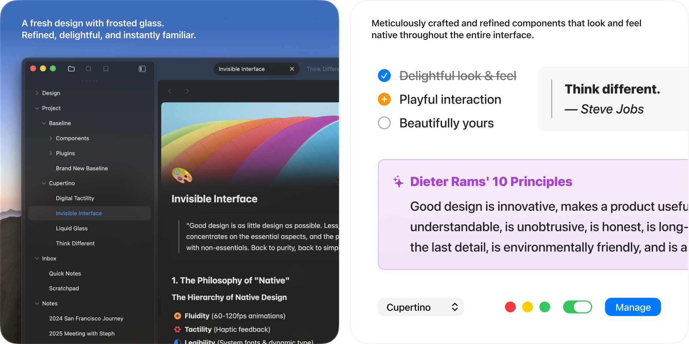
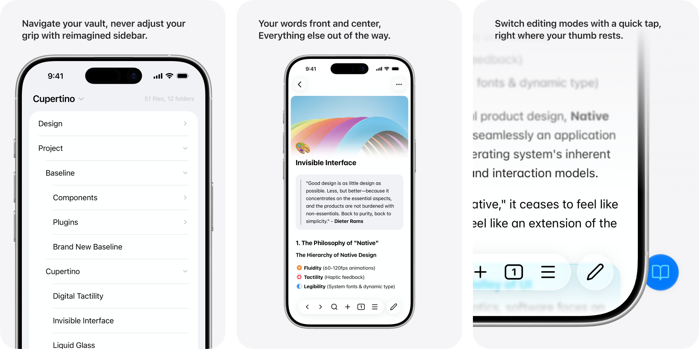
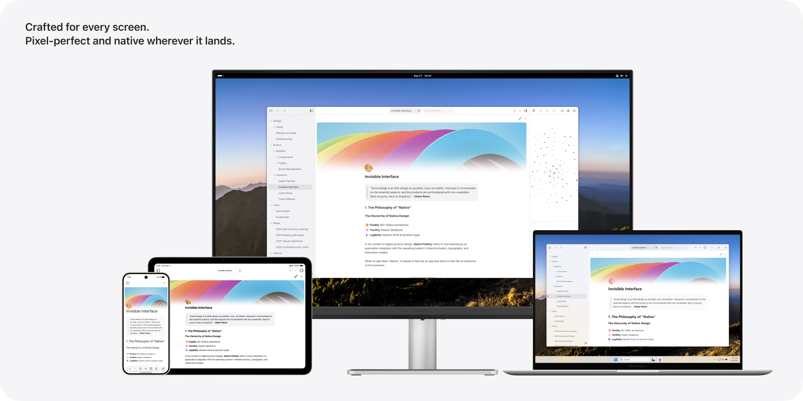

# Bamboo China（竹林中国）

> 以墨与纸为语言的 Obsidian 主题 —— 白纸为心，黛青为框。

Bamboo China 是一套原生、克制的 Obsidian 主题。编辑器画布保持纯净的「宣纸」底色，侧栏与面板承托意境配色的「框架」；在明/暗两种基底之上，提供 16 套命名的东方意境配色（墨夜、胭脂、青绿……），每一套都共享同一套结构骨架，却各有情绪基调。

## 预览

| 桌面端 | 移动端 |
|---|---|
|  |  |

| 自适应细节 | 复选框 |
|---|---|
|  |  |

## 设计理念

- **墨与纸**：动效取法「卷轴舒展」——轻微的过冲、从容的节奏，绝不仓促（品牌曲线 `cubic-bezier(0.34, 1.56, 0.64, 1)`）。
- **白纸为心、黛青为框**：编辑区始终纯净如纸，侧栏与面板承载意境色调。
- **字体优先 CJK 可读**：`SF Pro` → `PingFang SC` / `Hiragino Sans GB` / `Microsoft YaHei`，在中文与拉丁文之间取得平衡。
- **适度圆角与密度**：`radius-modifier` 与 `density` 默认均为 `1`，利落而不冰冷。

## 核心特性

- **16 套东方意境配色**：通过 Style Settings 一键切换，明/暗双基底通用；配色由单一数据源生成，跨平台外观完全一致。
- **默认「宣纸竹青」调色板**：明亮清爽的浅色基底，配以竹青点缀；深色模式作为可选基底，而非主题性格本身。
- **平台细节自适应**：在 macOS（或任意平台关闭「自适应模式」）呈现 Cupertino 细节——红绿灯窗口控件、标签头装饰、无框布局；其他平台回退为中性跨平台外观。**形状有细微的 mac ↔ 非 mac 之分，颜色 100% 由意境驱动、与平台无关。**
- **丰富的 Style Settings 可调项**：意境配色、侧栏与面板展开、专注视图、块宽限制、字体与字号、图标大小、链接样式、动画速度、无障碍（高对比强调色、减少动画、正文行间距）等 30+ 开关与滑块。
- **无障碍优先**：默认调色板与每一套 `cn-*` 意境配色均通过 WCAG 对比度校验；统一的 `:focus-visible` 焦点环；尊重 `prefers-reduced-motion`。
- **多脚本友好**：不仅服务于中文，英文、日文、韩文及其他书写系统同样适用。

## 安装

主题已提交至 Obsidian 官方社区主题列表。在 Obsidian 中：

1. 设置 → 外观 → 主题 → 管理 → 社区主题浏览
2. 搜索 **Bamboo China**
3. 点击「使用」，并在「Style Settings」中按需微调

## 自定义

大部分视觉调整都可通过 **Style Settings**（需安装 Style Settings 插件）完成，无需改代码：

- **意境配色**：切换 16 套东方意境主题
- **侧栏 / 面板**：展开或收起功能区、侧边栏标签、状态栏
- **专注视图 / 块宽限制**：为长文阅读营造更安静的版面
- **字体与密度**：界面字号、标准字号、图标大小、行间距
- **无障碍**：高对比强调色、减少动画、减少对比度变化

## 平台说明

| 平台 | 表现 |
|---|---|
| macOS | Cupertino 细节（窗口控件、标签头、无框布局） |
| 其他桌面 | 中性跨平台外观，配色完全一致 |
| Android / Windows | 个别隔离微调，非独立皮肤 |

主题在所有平台共用同一套视觉语言与同一份 `theme.css`。

## 仓库结构

```
src/                  主题源码（Sass，单皮肤 Bamboo China）
  app/                全局 token 与基础组件样式
  elements/           Bamboo China 表层细化（含 mod-macos 分支）
  color-schemes/     默认调色板 + 16 套 cn-* 意境配色（生成）
  layouts/            布局 token
  features/          可选特性模块
scripts/             构建与护栏脚本（mood 生成、对比度/a11y/体积校验）
theme.css            编译产物（发布用）
manifest.json        主题清单
versions.json        版本映射
```

构建：`npm run build`（生成 mood token → 编译压缩 CSS → 校验 mood 一致性）。

## 许可

[MIT](LICENSE) © 羽鳞君
