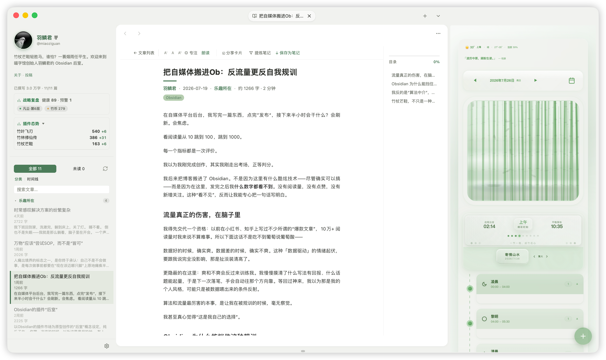

# Bamboo China（竹影 · 宣纸竹青）

> 以墨与纸为语言的 Obsidian 主题 — 白纸为心，黛青为框。



---

## 设计理念

- **墨与纸**：动效取法「卷轴舒展」—— 轻微的过冲、从容的节奏，绝不仓促（品牌曲线 `cubic-bezier(0.34, 1.56, 0.64, 1)`）。
- **白纸为心、黛青为框**：编辑区始终纯净如纸，侧栏与面板承载意境色调。
- **字体优先 CJK 可读**：`SF Pro` → `PingFang SC` / `Hiragino Sans GB` / `Microsoft YaHei`，在中文与拉丁文之间取得平衡。
- **适度圆角与密度**：利落而不冰冷。

## 核心特性

- **10 套东方意境配色**：通过 Style Settings 一键切换，明/暗双基底通用；配色由单一数据源生成，跨平台外观完全一致。
- **默认「宣纸竹青」调色板**：明亮清爽的浅色基底，配以竹青点缀；深色模式作为可选基底，而非主题性格本身。
- **平台细节自适应**：在 macOS 呈现 Cupertino 细节 —— 红绿灯窗口控件、标签头装饰、无框布局；其他平台回退为中性跨平台外观。形状有细微的 mac ↔ 非 mac 之分，颜色 100% 由意境驱动、与平台无关。
- **Style Settings 深度可调**：意境配色、侧栏与面板展开、标签页样式、状态栏、图片缩放、链接样式、动画速度、字号与图标大小等 22 项开关与滑块。
- **无障碍**：默认调色板与每一套意境配色均通过 WCAG 对比度校验；统一的 `:focus-visible` 焦点环；尊重 `prefers-reduced-motion` 与 `prefers-contrast`。
- **多脚本友好**：中文、英文、日文、韩文及其他书写系统同样适用。

## 意境配色一览

| Class | 名称 | 基调 |
|---|---|---|
| `none` | 竹影 · 宣纸竹青 | 竹青强调 · 宣纸白画布 — 克制的原点 |
| `cn-yanzhi` | 胭脂 · 米色朱砂 | 朱砂红强调 · 米色侧栏 — 温润古典 |
| `cn-qinglu` | 青绿 · 千里江山 | 石青绿强调 · 青灰侧栏 — 清新生机 |
| `cn-liujin` | 鎏金 · 秋棠金辉 | 金辉强调 · 秋棠侧栏 — 温暖厚重 |
| `cn-tianqing` | 天青 · 雨过天青 | 天青强调 · 天灰侧栏 — 清透宁静 |
| `cn-daizi` | 黛紫 · 紫烟幽兰 | 紫罗兰强调 · 紫灰侧栏 — 优雅静谧 |
| `cn-haitang` | 海棠 · 粉颊红晕 | 海棠粉强调 · 粉灰侧栏 — 温柔少女 |
| `cn-bohe` | 薄荷 · 清凉薄荷 | 薄荷绿强调 · 浅绿侧栏 — 清爽宜人 |
| `cn-hupo` | 琥珀 · 蜜珀流光 | 琥珀橙强调 · 暖褐侧栏 — 醇厚温暖 |
| `cn-dianlan` | 靛蓝 · 群青深蓝 | 靛蓝强调 · 蓝灰侧栏 — 沉稳专业 |
| `cn-songhua` | 松花 · 橄榄新绿 | 橄榄绿强调 · 绿灰侧栏 — 自然朴实 |

## 安装

主题已提交至 Obsidian 官方社区主题列表。在 Obsidian 中：

1. 设置 → 外观 → 主题 → 管理 → 社区主题浏览
2. 搜索 **Bamboo China**
3. 点击「使用」，并在 **Style Settings** 插件中按需微调

## 自定义

大部分视觉调整都可通过 **Style Settings**（需安装社区插件 Style Settings）完成，无需改代码：

- **意境配色**：切换 10 套东方意境主题
- **侧栏 / 面板**：悬停功能区、侧边栏标签、状态栏
- **标签页与链接**：左对齐标签页、简约标签、链接样式
- **字体与密度**：界面字号、标准字号、图标大小、行间距
- **无障碍**：减少动画、标准字号、高亮链接颜色

## 仓库结构

```
src/                  主题源码（Sass）
  app/                全局 token 与基础组件样式
  elements/           Bamboo China 表层细化
  color-schemes/     默认调色板 + 10 套意境配色（生成）
  layouts/            布局 token
  features/          可选特性模块
scripts/             构建与护栏脚本（mood 生成、对比度校验、体积校验）
theme.css            编译产物
manifest.json        主题清单
versions.json        版本映射
```

构建：`npm run build`（生成 mood token → 编译压缩 CSS → 校验 mood 一致性）。

## 基于 / 鸣谢

本主题派生自 [Cupertino](https://github.com/aaaaalexis/obsidian-cupertino) 主题（作者 **aaaaalexis**，基于 MIT 许可证）。原主题的版权声明随附于 [LICENSE](LICENSE)。

## 许可

[MIT](LICENSE) © 2025 aaaaalexis, © 2026 羽鳞君

---

## English

### Design Philosophy

- **Ink & Paper**: Motion follows the rhythm of a scroll unfurling — gentle overshoot, unhurried cadence (signature curve `cubic-bezier(0.34, 1.56, 0.64, 1)`).
- **Rice-Paper Heart, Indigo Frame**: The editor canvas stays clean as paper; sidebars and panels carry the mood-tinted accent.
- **CJK-First Typography**: `SF Pro` → `PingFang SC` / `Hiragino Sans GB` / `Microsoft YaHei`, balanced for both Chinese and Latin scripts.
- **Thoughtful Radius & Density**: Crisp without feeling cold.

### Core Features

- **10 Eastern Mood Palettes**: Switch via Style Settings; shared light/dark skeleton, generated from a single data source for cross-platform consistency.
- **Default "Rice-Paper Bamboo-Green" Palette**: Bright, clean light base with bamboo-green accents. Dark mode is an optional base, not the theme's identity.
- **Platform-Adaptive Details**: macOS gets Cupertino touches — traffic-light window controls, tab-bar ornament, frameless layout. Other platforms fall back to a neutral cross-platform look. Subtle mac ↔ non-mac shape differences; colors are 100% mood-driven and platform-agnostic.
- **Rich Style Settings**: 13 class toggles + 9 sliders covering mood palettes, sidebar/panel expansion, tab style, image zoom, link styling, animation speed, font size, and icon size.
- **Accessibility First**: Every palette passes WCAG contrast validation; unified `:focus-visible` focus ring; respects `prefers-reduced-motion` and `prefers-contrast`.
- **Multi-Script Friendly**: Works for Chinese, English, Japanese, Korean, and other writing systems.

### Installation

Available on the Obsidian Community Theme Store:

1. Settings → Appearance → Themes → Manage → Browse Community Themes
2. Search **Bamboo China**
3. Click "Use" and fine-tune via the **Style Settings** plugin

### Customization via Style Settings

- **Mood Palette**: 10 Eastern mood themes
- **Sidebar & Panels**: Hover ribbon, sidebar tabs, status bar
- **Tabs & Links**: Left-aligned tabs, unstyled tags, link styles
- **Typography & Density**: UI font size, standard font size, icon size, line height
- **Accessibility**: Reduce motion, standard font size, highlight link colors

### Credits

Derived from [Cupertino](https://github.com/aaaaalexis/obsidian-cupertino) by **aaaaalexis** (MIT). Original copyright notice included in [LICENSE](LICENSE).

### License

[MIT](LICENSE) © 2025 aaaaalexis, © 2026 羽鳞君
